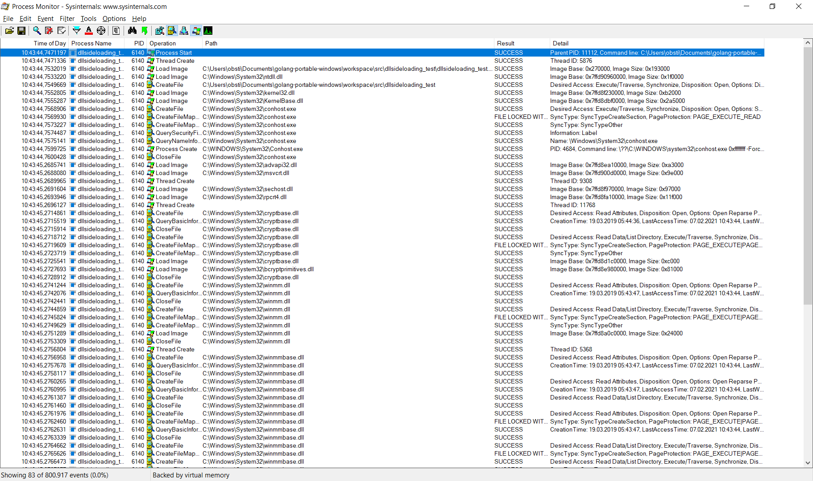
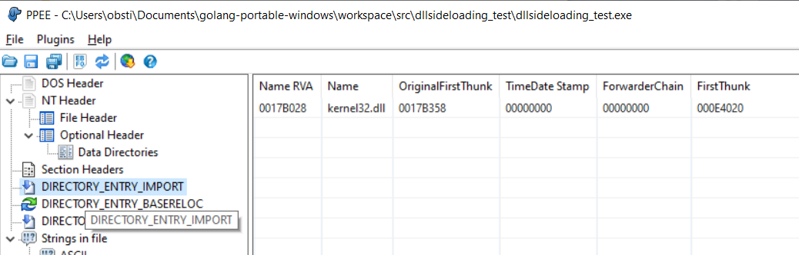
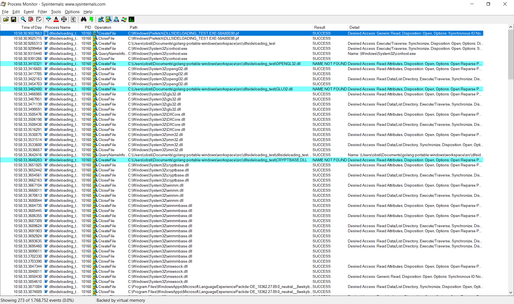
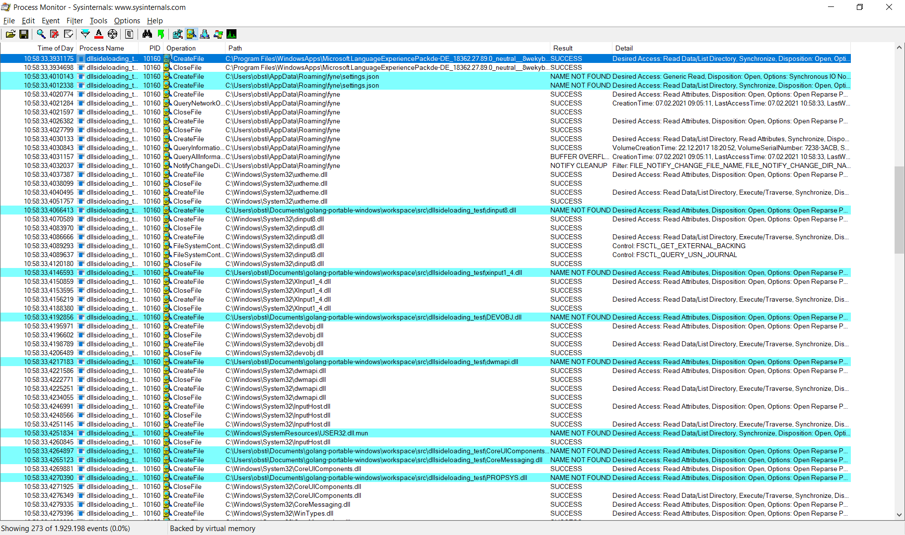
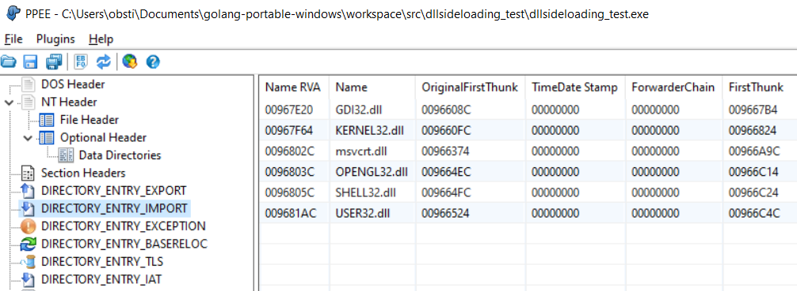
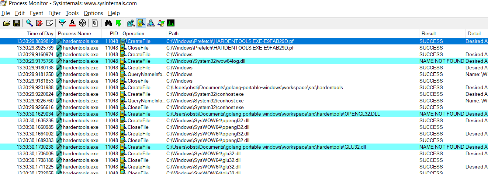

# Golang Remediate Issues with Windows DLL Sideloading / Preloading Hijacking

## Introduction

See <https://attack.mitre.org/techniques/T1574/001/> for a general introduction.

Golang applications are affected, if you distribute only a single portable executable (without installer) - which is quite easy in Go and one of the big advantages of Go in general. Especially if the user starts the application directly from the download folder.

The following gives an overview how DLL sideloading issues can be identified and (partly) remediated.

## Identification
The following tests have been done on Windows 10 with go version 1.15.8 windows/amd64.

### Simple go program - no DLL sideloading possible
 
    package main 
    
    import ( 
        "time" 
    ) 
    
    func main() { 
        time.Sleep(3 * time.Second) 
    }
 
As we can see in Process Monitor (sysinternals tools) there are no tries to open any DLL in the current directory: 

In the file header import table only the kernel32.dll is listed (not affected since it is in the so called Known DLLs list): 

### Simple fyne.io program 

Problems start when using libraries that require Windows DLLs to be loaded, e.g. the GUI Toolkit fyne.io (<https://fyne.io/>).

Example:
    package main 
    
    import ( 
        "fyne.io/fyne/v2/app" 
        "fyne.io/fyne/v2/container" 
        "fyne.io/fyne/v2/widget" 
    ) 
    
    func main() { 
        a := app.New() 
        w := a.NewWindow("Hello") 
        
        hello := widget.NewLabel("Hello Fyne!") 
        w.SetContent(container.NewVBox(hello, 
            widget.NewButton("Hi!", func() { 
               hello.SetText("Welcome :)") 
                }), 
            )) 
        w.ShowAndRun() 
    } 

Now we see lots of tries to access DLLs in the current directory of the application: 
 
 
Static imports: 

 
 
## Remediation 

As described in the articles (see references) there are three methods to remediate the issue for at least the dynamically loaded DLLs:

1. Make sure in the source code that loads the DLL that the current directory is excluded (e.g. by using an absolut path) - best method, but not available if you use third party libraries that you don't want to patch
2. Call `SetDLLDirectory("")` at the start of your program (in `main` or `init`), to exclude the local directory from the search path. This will not work, if your library loads the DLL in an `init()` function that precedes your code. Available since Windows 7 with patch.
3. Call `SetDefaultDllDirectories(0x00000800)` to restrict the search path only to system32 directory. This will not work, if your library loads the DLL in an `init()` function that precedes your code. Available since Windows 8.

Problem is that at least in the Go version 1.15.8 is that you can't use the function call `windows.SetDllDirectory("")` (from package `golang.org/x/sys/windows`) because this doesn't work (perhaps an issue in converting empty strings???). Using `windows.SetDefaultDllDirectories(0x00000800)` however works.

You can still call the windows method manually using the following code (from <https://github.com/keybase/kbfs/blob/master/vendor/github.com/keybase/client/go/libkb/saferdllloading_windows.go>):

safedllloading.go: 

    // Copyright 2016 Keybase, Inc. All rights reserved. Use of
    // this source code is governed by the included BSD license.
    // source: https://github.com/keybase/kbfs/blob/master/vendor/github.com/
    //         keybase/client/go/libkb/saferdllloading_windows.go

    package main

    import (
        "errors"
        "syscall"
        "unsafe"
    )

    const loadLibrarySearchSystem32 = 0x800

    // SaferDLLLoading sets DLL load path to be safer.
    func SaferDLLLoading() error {
        kernel32, err := syscall.LoadDLL("kernel32.dll")
        if err != nil {
            return err
        }

        procSetDllDirectoryW, err := kernel32.FindProc("SetDllDirectoryW")
        if err != nil {
            return err
        }
        var zero uint16
        r1, _, e1 := syscall.Syscall(procSetDllDirectoryW.Addr(), 1,
            uintptr(unsafe.Pointer(&zero)), 0, 0)

        procSetDefaultDllDirectories, err := kernel32.FindProc("SetDefaultDllDirectories")
        if err == nil && procSetDefaultDllDirectories.Addr() != 0 {
            r1, _, e1 = syscall.Syscall(procSetDefaultDllDirectories.Addr(), 1,
                loadLibrarySearchSystem32, 0, 0)
            if r1 == 0 {
                return e1
            }
        } else {
            return errors.New("SetDefaultDllDirectories not found - please install KB2533623 for safer DLL loading")
        }
        return nil
    }

Example Main.go: 

    package main

    import (
        "golang.org/x/sys/windows"
    )

    func main() {
        // Works by correctly calling SetDLLDirectory with empty string
        SaferDLLLoading()

        // also seems to work,
        // only available on Win8+
        //windows.SetDefaultDllDirectories(0x00000800)

        // does not work, Go lib seems to not convert
        // empty strings correctly.
        //windows.SetDllDirectory("")

        // Load DLL for demo
        windows.LoadLibrary("dwmapi.dll")
        //windows.LoadLibrary("dwmapi.dll")
    }

This mostly remediates the issues with fyne.io DLLs, except the static opengl32.dll and its dependency glu32.dll, which still remain (because of being a static dependency compiled into the file header):
 

## References

* <https://support.microsoft.com/en-us/topic/secure-loading-of-libraries-to-prevent-dll-preloading-attacks-d41303ec-0748-9211-f317-2edc819682e1>
* <https://docs.microsoft.com/en-us/windows/win32/api/winbase/nf-winbase-setdlldirectorya>
* <https://docs.microsoft.com/en-us/windows/win32/api/libloaderapi/nf-libloaderapi-setdefaultdlldirectories>
* <https://github.com/golang/go/issues/14959>
* <https://needleinathreadstack.wordpress.com/2017/09/22/preventing-system-dll-sideload-attacks/>